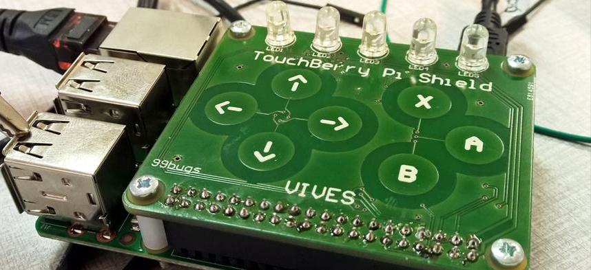

# TouchberryPi Python Package

Python library for the Touchberry Pi shield v2 for the Raspberry Pi 3



## Install SmBus python package

```shell
sudo apt-get update && sudo apt-get install python3-smbus
```

## Development

Installing the package:

```shell
pip3 install .
```

Force re-installing package:

```shell
pip3 install --upgrade --no-deps --force-reinstall .
```

Removing the package:

```shell
pip3 uninstall touchberrypi
```

Checking installed packages:

```shell
pip3 freeze
```

## Some info on SmBus methods

[http://www.raspberry-projects.com/pi/programming-in-python/i2c-programming-in-python/using-the-i2c-interface-2](http://www.raspberry-projects.com/pi/programming-in-python/i2c-programming-in-python/using-the-i2c-interface-2)
